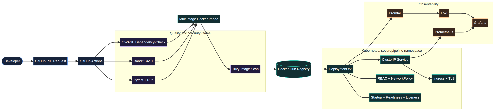

# SecurePipeline Engineering Report

## Executive Summary

SecurePipeline is a production-minded DevSecOps deployment platform built for the TechSkillHub DevOps Engineer Internship. The project demonstrates a repeatable path from source code to a monitored Kubernetes workload. It combines automated quality checks, static security analysis, dependency analysis, container vulnerability scanning, image packaging, Kubernetes security controls, and an observability foundation.

The repository is intentionally structured so that each platform concern is visible and reviewable. The application is small enough to run on a two-core Ubuntu VMware guest while still exposing the operational interfaces expected from a modern service: health, readiness, and Prometheus metrics endpoints.

## Objectives and Scope

The project automates the main stages of a secure application delivery lifecycle. A developer submits code through GitHub, GitHub Actions executes quality and security gates, a multi-stage Dockerfile produces a non-root image, and Kubernetes deploys the service with rolling updates and explicit runtime controls. Prometheus and Grafana provide the metrics foundation, while Loki and Promtail are prepared for centralized log collection.

The implementation covers the internship’s required technology areas: Ubuntu Linux, Git, GitHub Actions, Docker, Kubernetes, Trivy, OWASP Dependency-Check, Prometheus, Grafana, Loki, and Promtail. The project does not include private credentials, TLS private keys, or environment-specific secrets.

## Architecture

The delivery flow is shown in `architecture.png`. GitHub is the system of record for source and workflow definitions. GitHub Actions runs tests and linting, Bandit SAST, OWASP Dependency-Check, Docker image building, and Trivy scanning. Only an image that passes the configured security gate is eligible for release. Kubernetes then provides the runtime boundary and exposes metrics for observability.

## Application Design

The Flask service provides four primary interfaces. The root endpoint returns service metadata and the current release environment. The health endpoint supports liveness checks, the readiness endpoint supports traffic admission during rollouts, and the metrics endpoint exports request counters in Prometheus format. The service is configured through environment variables, uses Gunicorn in the container, and defaults to a local-only bind host when executed directly.

## DevSecOps Controls

| Control | Implementation | Purpose |
|---|---|---|
| Source control | GitHub repository with main branch workflow | Centralized version history and review path |
| Quality gate | Pytest and Ruff | Prevent regressions and style drift |
| SAST | Bandit | Detect common Python security patterns |
| Dependency analysis | OWASP Dependency-Check | Identify vulnerable declared dependencies |
| Image scanning | Trivy | Detect high and critical OS/library vulnerabilities |
| Image hardening | Multi-stage build and non-root runtime | Reduce attack surface and privilege |
| Release tags | SHA and semantic version tags | Improve traceability and rollback capability |
| Secret handling | GitHub Actions secrets only | Keep credentials outside source control |

## Kubernetes Security and Reliability

The Kubernetes deployment is isolated in a dedicated namespace with Pod Security Admission labels set to restricted. The workload runs with a non-root security context, a RuntimeDefault seccomp profile, dropped Linux capabilities, disabled privilege escalation, and a read-only root filesystem. The deployment uses two replicas, controlled rolling updates, resource requests and limits, startup/readiness/liveness probes, and a PodDisruptionBudget.

The Service is internal by default through a ClusterIP. An Ingress manifest is included for an HTTPS-enabled environment, but the TLS secret must be created by the operator or cert-manager and must never be committed. A default-deny NetworkPolicy allows only the required application traffic from ingress and monitoring namespaces and DNS egress to kube-system. The service account token is not automatically mounted.

## Observability

The application’s request counter can be scraped by Prometheus through the Kubernetes endpoints discovery configuration. The Grafana dashboard definition contains panels for request rate, status codes, ready pods, CPU usage, and memory usage. Loki and Promtail are documented as the centralized logging layer for container output. On the constrained two-core VM, the monitoring stack should be installed selectively and validated after the core application deployment is stable.

## Validation Evidence

The source repository’s GitHub Actions quality workflow passed tests, linting, and image build validation. The security workflow passed Bandit, OWASP Dependency-Check, and Trivy after the workflow was corrected to use supported action versions and the container image was hardened against reported findings. Local Ubuntu validation must additionally capture the Docker health response, the non-root container identity, Kubernetes rollout status, service reachability through port forwarding, and Prometheus dashboard output.

| Evidence | Expected result |
|---|---|
| `pytest -q` | Five tests pass |
| `ruff check .` | No lint violations |
| `docker run ...` | Health endpoint returns healthy |
| `docker exec ... id` | Runtime user is `appuser`, not root |
| `kubectl get nodes` | Minikube node is Ready |
| `kubectl rollout status` | Deployment successfully rolled out |
| `curl /health` through port-forward | JSON health response |
| Prometheus query | `securepipeline_http_requests_total` is present |

## Limitations and Next Improvements

GitHub Pages can present this project through the static dashboard in `docs/`, but it cannot execute the Flask service, Docker runtime, Kubernetes cluster, or monitoring stack. Those components require the Ubuntu VM or another Linux host. Docker Hub publishing also requires repository secrets and was intentionally not populated with credentials. The next improvements should include a pinned image digest deployment, a dedicated image registry, cert-manager-managed TLS, Kubernetes admission policy checks, an SBOM artifact, alert rules, and a tested rollback demonstration.

## Conclusion

SecurePipeline provides a coherent foundation for demonstrating DevSecOps engineering practices. Its strongest features are the explicit security gates, small and testable application surface, hardened image, Kubernetes least-privilege controls, and separation between the static portfolio dashboard and the actual runtime platform. The remaining work is operational evidence: execute the repository on the Ubuntu VM, deploy the image to Minikube, install observability components within available resources, and capture screenshots and final presentation material.
